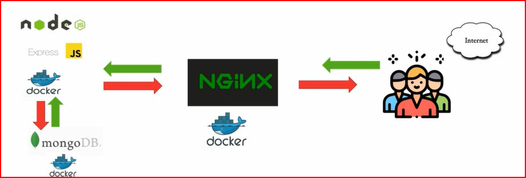

# nodeJs-MongoDB-Nginx-Docker-Tutorial

https://www.youtube.com/watch?v=4zUQEkDdNR0&list=PLVx1qovxj-ankJOMQslRT9hckrfcGQTpp&index=2

## We will see the procedure for dockerizing a Node.js web app with MongoDB database and Nginx as a reverse proxy in front of Node.Js app using docker.

